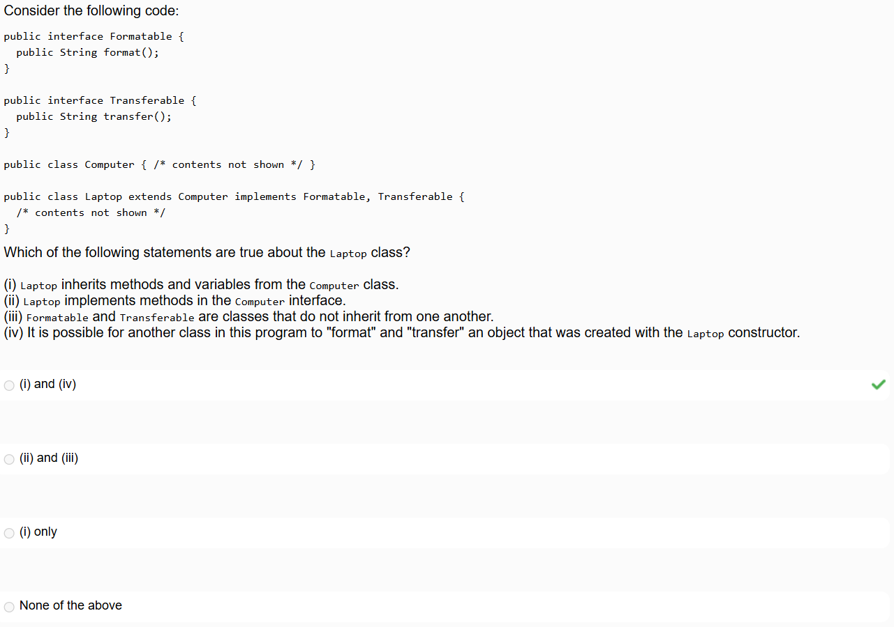

# 03-relationships-between-classes.md

Progress: New
: No
Parent item: Module 1 -- Sept 17-30 -- Java OOP (Module%201%20--%20Sept%2017-30%20--%20Java%20OOP%2026be7be659d980358a36cfb6580c99bc.md)
Resources: https://github.com/CSC207-UofT/207-course-notes/blob/master/03-relationships-between-classes.md

https://github.com/CSC207-UofT/207-course-notes/blob/master/code/gui/MainFrame.java

https://github.com/CSC207-UofT/207-course-notes/blob/master/code/gui/NestedPanelsExample.java

https://docs.oracle.com/javase/tutorial/java/IandI/
More Resources/Practice: screencapture-q-utoronto-ca-courses-394773-quizzes-460461-history-2025-12-13-17_22_56.pdf

# 3.1 Inheritance

```java
class Child extends Parent {
    ...
}
// => class Child inherits all the methods and variables defined in Parent
// => Child is an instance of Parent
```

## Abstract Classes

- `abstract`: signifies that a class/method is abstract; enforces the fact that no instance of the class should be created, even if there are no abstract methods in the class

```java
abstract class AbstractClass{
    abstract void something();    // Abstract methods have no body!
}
```

- Any non-abstract class that extends an abstract class then has to implement the body of all abstract methods

# 3.2 Interfaces

An **interface** in Java defines a contract for what a class can do, without specifying how it does it. It’s used to define shared behavior across potentially unrelated classes. This is similar to an abstract class, but fundamentally differs in that a class can implement any number of interfaces.

- If a class `extends` an interface, it guarantees to the program that the object instances of the class can use the interface: “a service that is guaranteed for the object/a service that can be used by objects in the program”
- Interfaces can also extend other interfaces

In an interface:

- All methods are implicitly `public` and **abstract**, unless marked otherwise. You can try defining a method in your own interface and see what IntelliJ warns you about if you include various keywords.
- Variables in an interface are implicitly `public`, `static`, and `final`. You can not have instance variables for an interface.
- Classes that implement an interface must provide implementations for its abstract methods.

(since Java 8) interfaces can include:

- `default` methods — methods with a body, allowing backward-compatible enhancements without requiring updates to any classes already implementing an existing interface.
- `static` methods — useful for utility behaviour related to the interface.



Formatable and Transferable are services that are guaranteed for laptops

# 3.3 `super`

When extending another class, Java *requires* a call to a constructor of its superclass to be made in the constructor of the subclass. Furthermore, this call *must* be the very first thing done. 

If no constructor call is explicitly made in the subclass constructor, then an *implicit* call to `super()` will be made.

The only time Java will implicitly call the parent constructor is when the only constructor that exists in the parent class takes no arguments.

If the parent class has a constructor taking no arguments, then we can even omit a constructor in the subclass if we don't need to perform any additional information. Java will implicitly call the parent constructor when creating a new instance of our subclass.

# 3.4 Polymorphism

**Polymorphism** is the ability of an object to take on many forms. In Java, this means that an object can be treated as an instance of its own class, any superclass, or any interface it implements.

# 3.5 Casting

**Casting** is when we explicitly change the type of a reference to another, usually to access more specific functionality that isn't available in the more general type.

**Casting** is the process by which Java is told to consider the type of an object something other than the class whose constructor was used to create the object.

Casting is safe only when the actual object is an instance of the target type (i.e., will pass `instanceOf` checks), o/w runtime errors results

**Upcasting** is when we assign a subclass object to a superclass reference; implicit and always safe; e.g., `Animal a = new Dog();`

**Downcasting** is converting from a superclass to a subclass; e.g., `((Dog) a).bark();`

Casting objects:

"re-labeling" the reference type — we're telling the compiler to treat the object as a different type, without changing the object itself. The actual data remains the same.

Casting primitives:

converting the value itself, which may result in loss of precision or truncation

e.g.,
`double y = 3.7;
int truncated = (int) y; // truncated to 3` ← irreversible!

Primitive casting can be **implicit** (e.g., `int` to `double`) or **explicit** (e.g., `double` to `int`), depending on whether there's a risk of data loss.

The single line that executes the cast changes the memory arrow and references to the casting designation object type just for that line, then it returns to original object type - *pls review October 17, 2025* 

example 1:

```java
Person s1 = new Student(“A B”);
Student s1 = (Student) s1 // s1 is a Student object

Person s2 = new Person();
s1.equals(s2) // would not work since s1 (actually a student) can't be compared with s2 (actually a person)
s2.equals(s1) // works 
```

example 2:


NOTE: s1.equals() would work and implement Student.equals() since the child class is considered the most recent/updated version