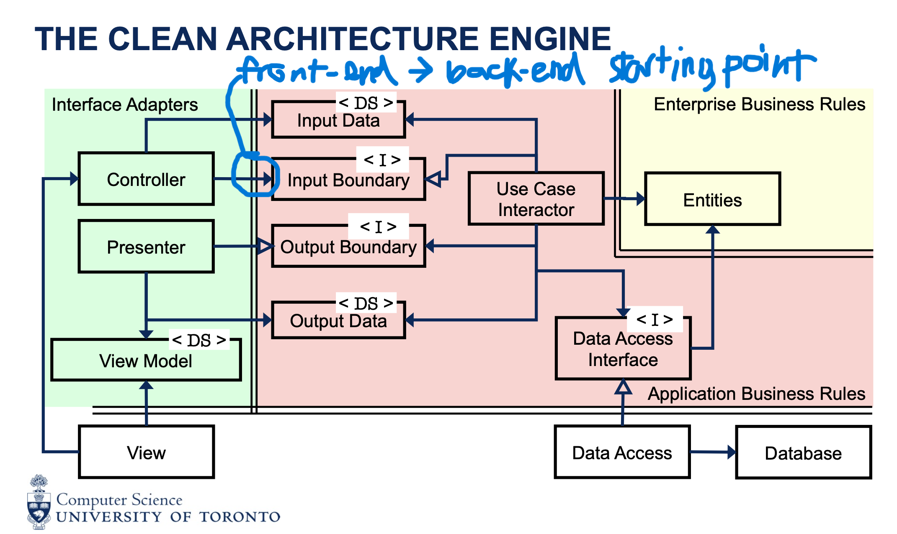

# Building the CA Engine

Progress: New
: No
Parent item: Module 3 -- Oct 15-Nov 4 -- Clean Architecture (Module%203%20--%20Oct%2015-Nov%204%20--%20Clean%20Architecture%2026be7be659d980b0aaf7c9535063f6f0.md)
Practice: https://q.utoronto.ca/courses/394773/pages/m3-building-the-ca-engine



```java
public class Main {
    public static void main(String[] args) {
        AppBuilder appBuilder = new AppBuilder();
        
        JFrame application = appBuilder
                .addLoginView() // A
                .addSignupView()
                .addLoggedInView() // B
                .addSignupUseCase()
                .addLoginUseCase() // C
                .addChangePasswordUseCase() // D
                .build();

        application.pack();
        application.setVisible(true);
    }
}
```

- Part 1: The bold lines are clearly necessary to assemble our signup use case, but which one of the four labelled method calls is also necessary for setting up our signup use case?
    
    multiple possible answers:
    
    - A .addLoginView(): can argue you need a login view that gives people the option to login and to signup
    - B .addLoggedInView(): can argue that you show the logged in view after signup is complete
    - .addLoginUseCase(): don’t need login use case for sign-up use case
    - .addChangePasswordUseCase(): don’t need to be able to change password when signing up
- Part 2 row 1:
    - C - SignupInputData: isn’t needed at the very beginning before the program runs since it is a temporary object that stores users’ input until it is taken in (via getter) by the use case interactor
    - InMemoryUserDataAccessObject: stores all the information that is needed upon program startup since the program cannot run on no information (analogy: ACORN running without any student entities)
    - SignupInputBoundary (implemented by UserCaseInteractor) would be needed
- Part 2 row 2:
    - A. User: user entity is created once the user signs up → not needed as part of initial CA engine
        - can also argue that past created user entities are needed ⇒ dependent on program design choices
    - SignupViewModel: stores information that is only needed for the front-end (e.g., font, colour, etc.) that doesn’t affect program logic/function — needed so the presenter knows what to show on the front-end
    - SignupInteractor: needed to run the program logic needed for signing up
- Part 2 row 3:
    - D: we need them all
        - UserFactory: generates a bunch of User objects → needed so the data from signing up (e.g., username, password, etc.) can be inserted into the object
        - ViewManager: need to be able to manage at least the first view (sign-up)
        - SignupOutputBoundary: need to be able to display things like sign-up successful
- Part 2 row 4:
    
    C - SignupOutputData: we don’t need it until we have output data that needs to be shown (and the object only exists temporarily for the front view)
    
- Part 2 row 5:
    
    D - we need them all
    
- Part 2 row 6:
    - D - we need them all OR E - we don’t need any of them
        - if LoginView is needed, LoginViewModel is needed, and vice versa
        - likewise, LoginState tells the program what state (e.g., noOneLoggedIn, etc.) and is likely stored in ViewModel or alike
    - → if the program shows the login view as the first view, then D o/w E

Summary:

- for a program, you pretty much everything at the beginning from frontend to backend to data access
- you want to have the interfaces at the beginning of the program so you can change database, front-end freely without affecting program functionality
- at the beginning of the program, you don’t need Input/Output Data until you actually have input/output in the program later on