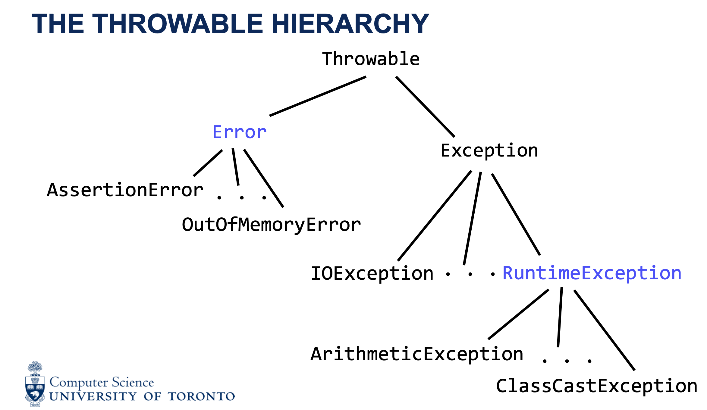
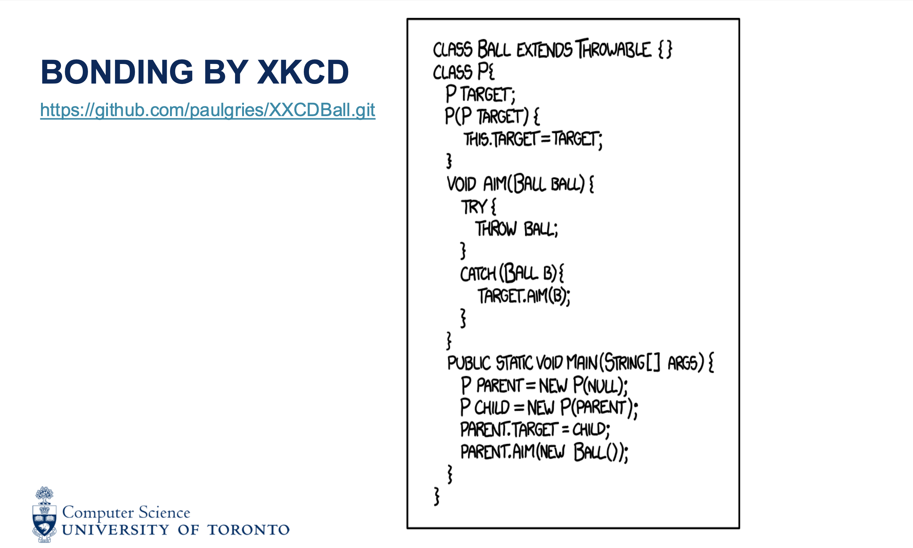

# Exceptions

Progress: New
: No
Parent item: Module 2 -- Oct 1-14 -- Design Principles (Module%202%20--%20Oct%201-14%20--%20Design%20Principles%2026be7be659d980fea17ce010271854ea.md)
Resources: https://github.com/CSC207-2025F-UofT/exception-examples
Practice: https://q.utoronto.ca/courses/394773/pages/m2-exceptions
More Resources/Practice: Exceptions.pdf

An "Error "is an unavoidable and unpredictable situation that can prevent your program from running properly. For example, if the computer you are using runs out of memory because of a different program running on it. Your program should not recover from that. It should stop running in this situation.

- something we can’t control and is unpredictable → just let the program **crash** (falls through the call stack)

"Exceptional" circumstances are situations that are predictable and unavoidable (not preventable). Java "throws" an Exception" object to halt all methods that are running until the Exception is caught.

- the Exception is *thrown* until it is *caught* and essentially aims to give a solution/recover from the exception (e.g., create a text file to write to, when the original text file was deleted external to the program) or at least alert the user
- exception: `RuntimeException` *crashes* (falls through the call stack) the program - and we want that, since these are preventable → we want to be able to identify where the issue is so we an fix it and prevent it
    
    A predictable and avoidable situation can be found by the JVM throwing a RuntimeException which will crash your program and print the stack trace (list of methods and the last line they ran) so that you can fix the code to prevent that situation in the future.
    

# Activities

- Which of the following `Throwable` is NOT a subclass of `Exception`?
A. RuntimeException
B. IOError
C. IOException
D. ArithmeticException
    
    B.
    
    - just look at the naming! should be self-explanatory!
- java.lang.FileNotFoundException
at FileWriter.save(MyClass.java:3)
at Scheduler.makeEvent(MyClass.java:8)
at Calendar.main(MyClass.java:10)
    
    C.
    
    save threw the exception and everything after stopped
    
- Activity 3
    
    c.
    
- Activity 4
    
    A.
    
    - we want `RuntimeException` to crash the program → unchecked
    - all other subclasses of `Exception` we want to recover from → check
- Activity 5
    
    D.
    

- activity 6 (^)
    
    A.
    
    the “ball” gets thrown back and forth due to the catch getting the other object to throw the ball back via aim